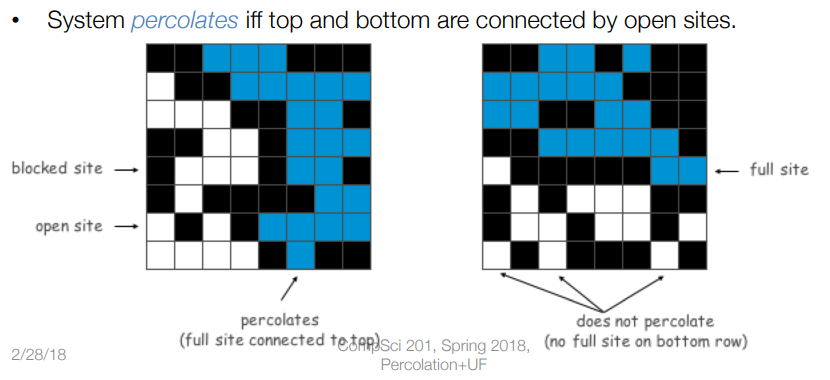

# Solving percolation with Union Find

This code (implemented in Java) has a solution to the percolation problem.

## :newspaper: The problem

The percolation problem involves studying the connectivity of a graph or network.

In this problem, we start with a graph or network, where each node or vertex is either "occupied" or "unoccupied" with some probability. The objective is to determine whether there is a path of occupied nodes that connects two given nodes or a set of nodes in the graph.

This problem has many applications in computer science, such as in the analysis of network connectivity, the design of robust communication networks, and the modeling of the spread of diseases or information through social networks.

    

## :white_check_mark: Goals

The goals in this code were to compare two solutions of percolation problem

* The first one (and less efficient) using recursion
* The second one (and more efficient) using the data structure [Union Find](https://en.wikipedia.org/wiki/Disjoint-set_data_structure)