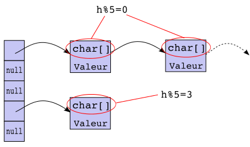

# Text Generator with Linked Lists and Hash maps

## :newspaper: The problem

The aim of this assignment is to write a Java program that will generate pseudo-text based on the 35 chapters of Gustave Flaubert's book. The method used for text generation is based on Markov chains.

The generated text will have the following properties: Given an integer n≥1

* All subsequences of n+1 words in the generated text are subsequences of n+1 words in Madame Bovary's text.

* The first n words of the text are the first n words of a chapter in Madame Bovary.

* The last n words of the text are also the last n words of a chapter in Madame Bovary.

## :white_check_mark: Goals

The objectives of this work are to implement hashmaps (dictionaries) from key-value sets based on linked lists.

    

