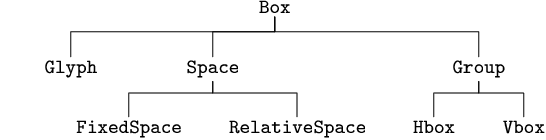

# Heritage with typography

## :white_check_mark: Goals

    

The goal of this assignment is to create the classes schematized above and test their functionality writing a visible text appearing in another window.

By the end of this exercise, the user should be able to get the following exit, after running the code.

    

