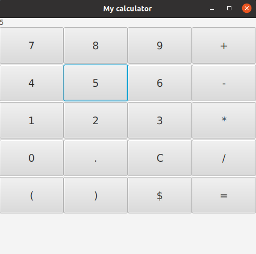

# Coding a Calculator in Java

## :white_check_mark: Goals

The goal of this assignment is to code a Java calculator, understand the logics behind it and get used with the framework [JavaFx](https://openjfx.io/).

    

By the end of this exercise, the students should be confortable handling front-end events such as mouse clicks and keyboard keys pressed.